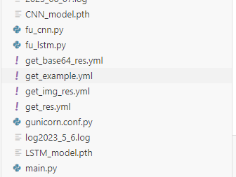
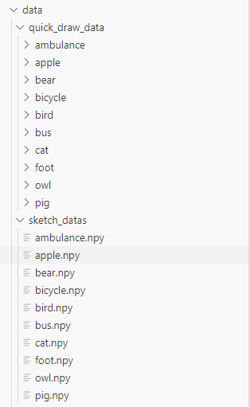

# quick_draw_web

## Project setup

The model weights should be in the root directory of the project. The two model weights should be named as `CNN_model.pth` and `LSTM_model.pth` respectively:

The dataset should be placed like this(data fold should also be in root directory of the project):

