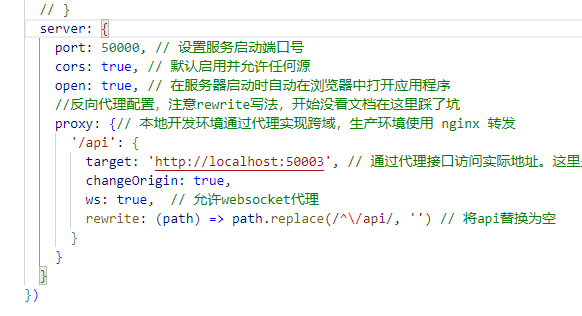

# quick_draw_web

## Project setup docker

### requirements

当前项目仅在 windows docker 上测试构建，其他平台未测试。

1. docker desktop 官方教程：[Install Docker Desktop on Windows | Docker Documentation](https://docs.docker.com/desktop/install/windows-install/)
2. docker compose 对于windows用户，安装docker desktop后就自带了
3. cuda11.3,cudnn8

### deployment

注意：在windows上安装docker必须使用较新的版本，旧版本的docker无法在容器内使用cuda

在进入项目的`./docker/`目录，然后运行`docker compose up`即可启动项目。

docker 容器在构建过程中可能会花费一些时间，请耐心等待

构建成功后，使用`docker compose up`来启动项目，此时会占用命令行，如果关闭命令行会导致程序运行停止，如果想要在后台运行，可以使用`docker compose up -d`来启动项目。

部署中可能出现显存不足的情况，需要修改`gunicorn.conf.py`文件中的这些设置：

workers决定python后端开启的进程条数（由于python存在PIL，因此在并行实现上往往采用开启多条进程的方式，而每条进程都会单独加载一次模型，导致显存占用随着进程数的提升而提升，如果不需要并行处理识别请求，可以减少workers的数量，以降低对电脑显存的要求），如果修改了workers，还需重新进行`docker compose build`步骤。

目前后端开启6进程显存占用约5.5GB

## 前端部署

docker 容器中只包含后端，前端需要单独部署，前端部署方式如下：

进入目录的`./web/`目录，如果没有安装node_modules，使用命令`npm install`，如果已经有`node_modules`，使用`npm run dev`就能运行vue前端

如果出现如下问题：

vite默认使用的端口5173可能会被 WSL 和 HyperV 占用，而这两个是windows上安装docker desktop 必须的，因此需要修改vite服务启动的端口：

注意：如果前后端分离部署，还需要修改`vite.config.js`文件中的`target`的url链接

## Project setup

The model weights should be in the root directory of the project. The two model weights should be named as `CNN_model.pth` and `LSTM_model.pth` respectively:

The dataset should be placed like this(data fold should also be in root directory of the project):

